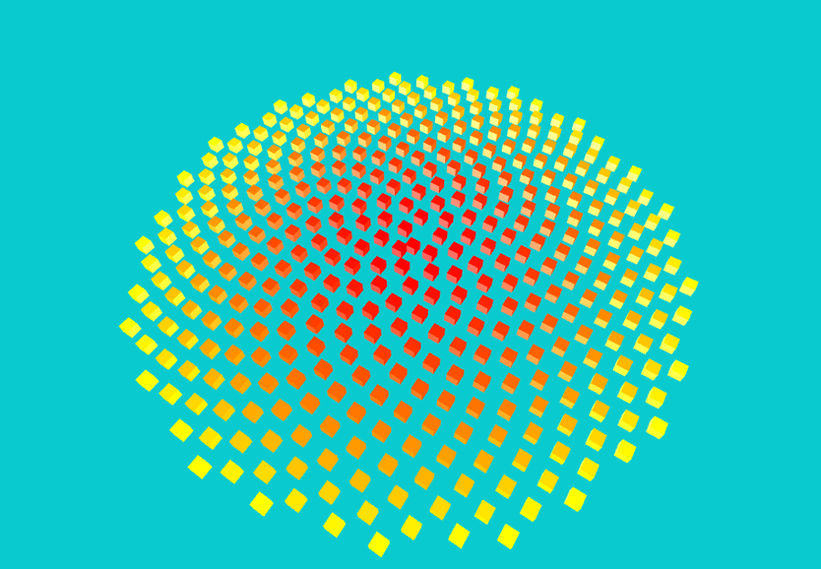
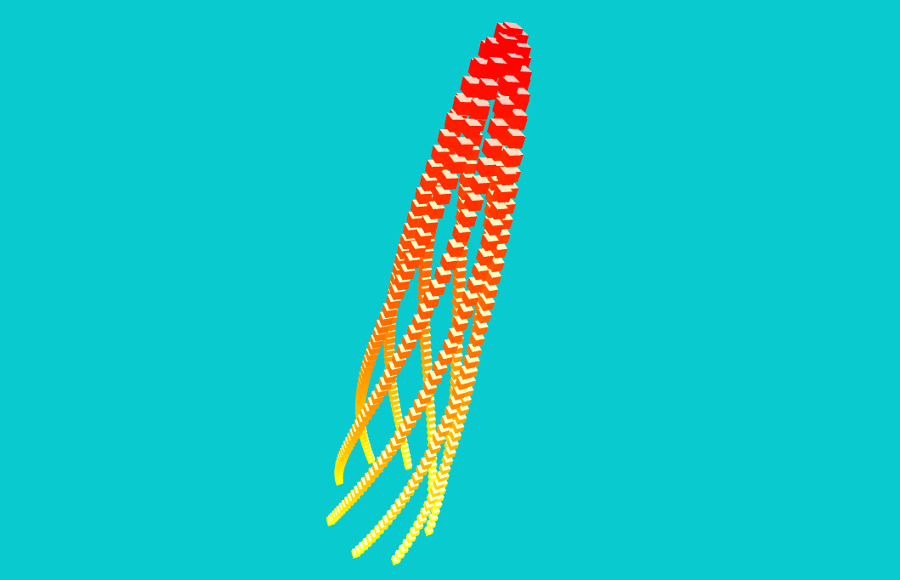
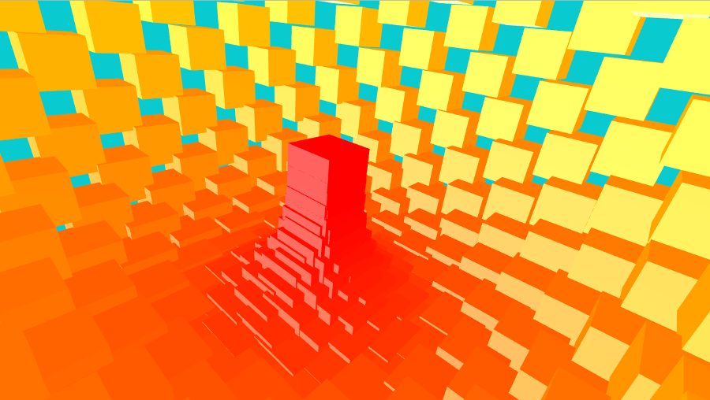

# ofxPhyllotaxis

This addons simply consists of three static methods that implements a model that describes the arrangement of leaves on a plant stem, called <a href="https://en.wikipedia.org/wiki/Phyllotaxis">phyllotaxis</a>.


## Usage
It can be used to position the elements of a collection composed by 2D or 3D forms. For example, assuming you have a bunch of `ofBoxPrimitive` in a vector, it can be used in a loop like this:

```cpp
// initialize a collection
children vector<ofBoxPrimitives>
int nCubes = 400;
for (int i = 0;  i < nCubes; i++) {
    children.push_back(ofBoxPrimitive(5,5,5));
}

// iterate and position items
float rad = ofDegToRad(137.5);
float spread = 0.3;
for (int i = 0;  i < nCubes; i++) {
    ofVec3f pos;
    pos = ofxPhyllotaxis::simple(i, rad, spread);
    children[i].setPosition(pos);
}
```

In the example application, it is used in a 3D scene. It provides 3 methods slightly differents from each other.

### Simple



```cpp
ofVec3f simple(const int i, const float angleInRadians, const float spread)
```

`i` is the current index in the iteration

`angleInRadian` is the angle that is used in the phyllotaxis. It needs to be expressed in radians

`spread` defines how much each element should be distant from the previous one

## Conical



```cpp
ofVec3f conical(const int i, const float angleInRadians,const float spread, const float extrude)
```

The parameters are the same as before, except

`extrude` defines how much the elements should be pushed on the `y` axis

## Apple

I did not find any better name, feel free to give me suggestions.
The following picture is taken from "inside the apple".



```cpp
ofVec3f apple(const int i, const float angleInRadians, const float spread, const int total)
```

The parameter `total` indicates the total number of the element in the collection.

